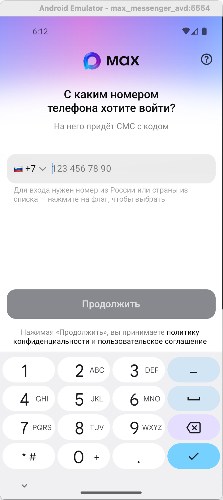

# Max in Jail

[](https://www.apple.com/macos/)
[](https://www.gnu.org/software/bash/)
[](https://opensource.org/licenses/MIT)

<div align="center">


**Безопасная установка мессенджера Max на macOS через эмулятор Android**

Если у вас нет подходящего телефона для установки Max — теперь это не проблема.<br>
Одной командой вы можете безопасно установить его в эмуляторе.

</div>

---

<div align="center">




</div>

---

## Быстрый старт

### Вариант 1: Запуск одной командой

Скопируйте команду в терминал и запустите:

```bash
curl -fsSL https://raw.githubusercontent.com/a0s/max-in-jail/main/max-in-jail.sh | bash
```

### Вариант 2: Локальный запуск

Склонируйте репозиторий и запускайте локально:

```bash
git clone https://github.com/a0s/max-in-jail.git
cd max-in-jail
./max-in-jail.sh
```

---

## Что устанавливается

Скрипт автоматически устанавливает необходимые компоненты:

### Глобально (через Homebrew)

Если компоненты отсутствуют, скрипт установит их глобально через Homebrew:

- **Homebrew** — менеджер пакетов (если не установлен)
- **Java (OpenJDK)** — для работы Android SDK
- **Python 3** — для инструментов Android SDK
- **jq** — для проверки версий APK из RuStore
- **pv** — для отображения прогресса загрузки
- **curl**, **unzip** — утилиты (обычно уже установлены в macOS)

> **Примечание:** Эти компоненты устанавливаются глобально и могут использоваться другими приложениями. При удалении проекта они не удаляются автоматически.

### Локально (в `~/.cache/max-in-jail`)

Все данные проекта хранятся локально в кэш-директории пользователя:

- **Android SDK** — инструменты разработки Android
- **Android Virtual Device (AVD)** — эмулятор Android
- **APK файлы** — установочные файлы приложения Max Messenger
- **Логи** — файлы логов установки и работы

> **Примечание:** Для полного удаления всех данных выполните:<br>
> `rm -r ~/.cache/max-in-jail`<br>
> или используйте: `./max-in-jail.sh --uninstall`

---

## Использование

По умолчанию скрипт запускает эмулятор в фоновом режиме и завершается. Эмулятор продолжает работать.

Справка:

```bash
./max-in-jail.sh --help
```

или

```bash
curl -fsSL https://raw.githubusercontent.com/a0s/max-in-jail/main/max-in-jail.sh | bash -s -- --help
```

```
Usage: ./max-in-jail.sh [OPTIONS]

Options:
  --attach     Run in foreground mode (follow logs, Ctrl+C stops emulator)
  --apk PATH   Use custom APK file instead of downloading
  --uninstall  Remove all data created by script
  -h, --help   Show this help message

By default, script runs in background mode:
  - Script exits, emulator keeps running
  - To stop emulator later, use: adb emu kill
```

### Использование кастомного APK файла

Вы можете указать свой APK файл вместо автоматической загрузки:

```bash
./max-in-jail.sh --apk /path/to/your/file.apk
```

Скрипт автоматически:

- Проверит существование файла
- Валидирует, что это корректный APK
- Использует его для установки

Пример:

```bash
./max-in-jail.sh --apk apks/max-25.19.0.apk
```

---

## Системные требования

✅ Гарантированно работает на **Apple M2**<br>
✅ Скорее всего работает на всех **M-чипах**<br>
⚠️ **Intel чипы** — под вопросом

---

## Лицензия

Этот проект распространяется под лицензией MIT. Подробности см. в файле [LICENSE](LICENSE).
